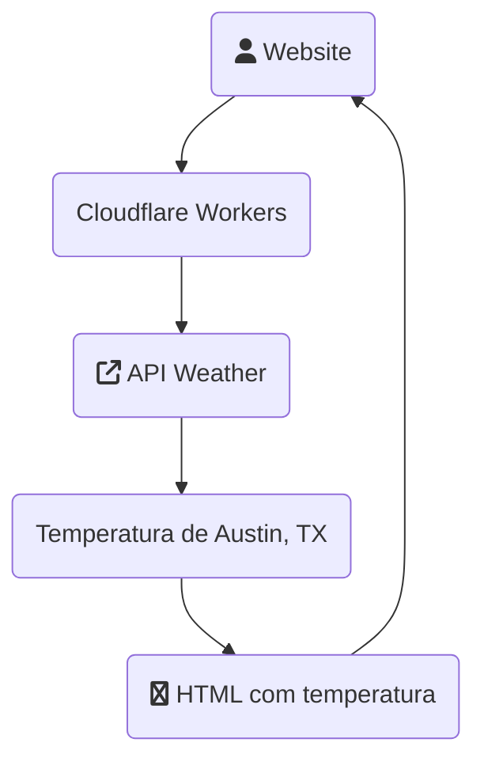

# Workers Weather

### Descrição

Exemplo de workers rodando uma solicitação de temperatura através de API
O workers busca a temperatura da cidade de Austin, TX.

### Endereço de teste (resultado)
https://weather.alicinomoura.xyz

### Estrutura
```
/cloudflare-workers-weather
|- wrangler.toml
|- src/
|  |- index.js
|- .github/
|  |- workflows/
|  |  |- deploy.yml
|- README.md
``` 

### Fluxo



